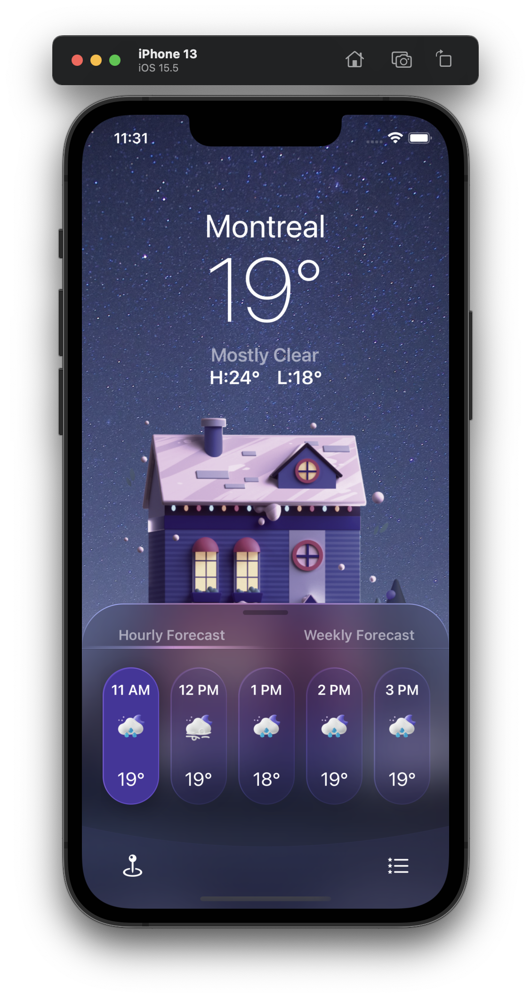
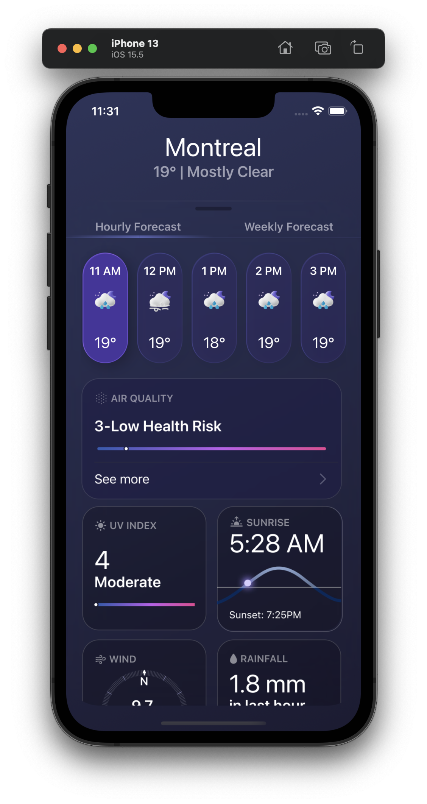
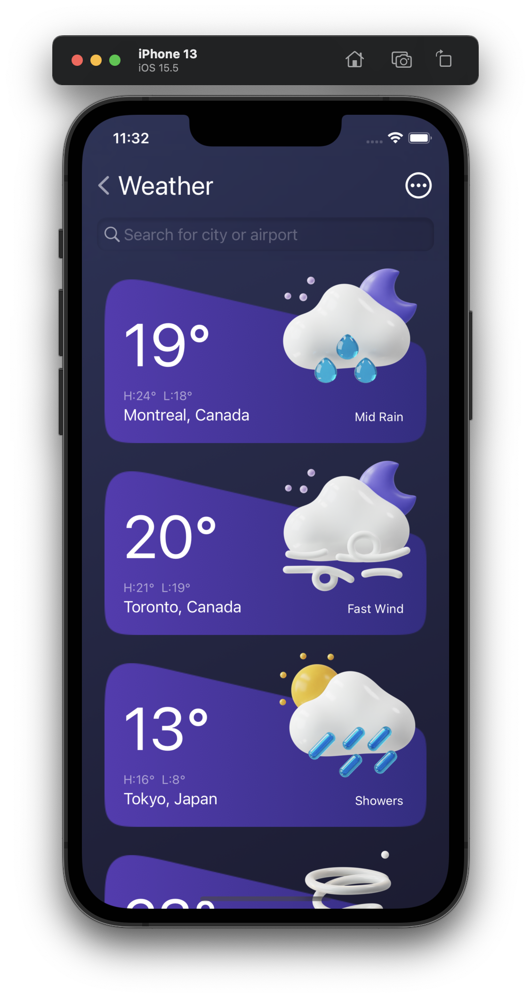

# AnimatedWeatherApp

#### Animated Weather App builded with SwiftUI

###### Hi, this is the weather app the I build from Design COde tutorial. From a beautiful UI design from Figma to a real iOS app. We have cool animations, such as the scroll parallax and the text transitions on the drag gesture. Also animated the cards with a scroll effect with the slide over when switching between the tabs of the segmented control.

###### There are custom components involved such as the tab bar, navigation bar, search bar, this bottom sheet with a stunning layer of background blur.

#### Dependecies used:
- `BottomSheet`

---

#### App Demo.
<table>
  <tr>
    <td>Home View</td>
	<td>Forecast View</td>
	<td>Weather View</td>
  </tr>
  <tr>
    <td></td>
	<td></td>
    <td></td>
  </tr>
</table>

https://user-images.githubusercontent.com/34775704/185788205-bacefb5c-2da9-44ad-b852-4190c416164d.mp4

---

Source of the project: [Design Code](https://www.youtube.com/watch?v=b8sP7AS0CAY)
